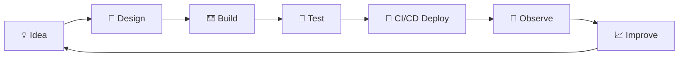

<!-- ════════════════ HEADER ════════════════ -->
<div align="center">
	


<br/>
Building scalable applications, reliable infrastructure, and automated delivery systems.
<br/>
<a href="https://github.com/subahanpathan"></a>
<a href="https://www.linkedin.com/in/subahan-pathan-a991a1337/"></a>
<a href="https://github.com/subahanpathan?tab=repositories"></a>

</div>

<!-- ════════════════ 01 ════════════════ -->
  01 · ENGINEERING PROFILE
<table>
<tr>
<td width="62%" valign="top">
I work across the full software lifecycle — product interfaces, backend services, databases, cloud infrastructure, CI/CD, and operational automation.
> **Build clean. Automate repeatable work.**
> **Ship reliably. Improve continuously.**
```yaml
role:      Full-Stack & DevOps Engineer
focus:     [ web apps, cloud infra, pipelines, AI apps ]
principles:
  - clarity over complexity
  - automation over repetition
  - security by default
  - observability always
status:    building · shipping · iterating
```
</td>
<td width="38%" valign="top">

</td>
</tr>
</table>
Area	Focus
Full-Stack Engineering	React · Next.js · TypeScript · Node.js · Python
Backend & Data	REST APIs · PostgreSQL · MongoDB · MySQL · Redis
DevOps & Cloud	Docker · Kubernetes · AWS · Linux · Nginx · Terraform
Delivery & Automation	Git · GitHub Actions · Jenkins · CI/CD · Scripting
---
<!-- ════════════════ 02 ════════════════ -->
🧭  02 · ENGINEERING FOCUS
<table>
<tr>
<td width="25%" valign="top">
🖥️ Product Engineering
Responsive interfaces
Component-driven UI
API integration
Full-stack applications
Production deployments
</td>
<td width="25%" valign="top">
🗄️ Backend Systems
REST APIs
Authentication
Data modeling
PostgreSQL / MongoDB
Service integration
</td>
<td width="25%" valign="top">
☁️ DevOps & Cloud
Docker
Kubernetes
AWS
Linux / Nginx
Infrastructure as code
</td>
<td width="25%" valign="top">
⚙️ Automation
GitHub Actions
Jenkins
CI/CD pipelines
Bash / Python tooling
Monitoring mindset
</td>
</tr>
</table>
---
<!-- ════════════════ 03 ════════════════ -->
🧱  03 · TECHNOLOGY STACK
<div align="center">
Application
<br/>

Data
<br/>

Cloud & Infrastructure
<br/>

Delivery & Tooling
<br/>

</div>
---
<!-- ════════════════ 04 ════════════════ -->
🚀  04 · FEATURED PRODUCTION WORK
<div align="center">
<a href="https://argus-lime-ten.vercel.app/">
  
</a>
⚡ ARGUS · Security Intelligence Platform
</div>
Real-time security intelligence built on endpoint telemetry, behavioral detection, threat correlation, and explainable signals — turning raw system activity into decisions analysts can act on: detect → investigate → assess exposure → contain → remediate.
<div align="center">
`React` `TypeScript` `Node.js` `Express` `PostgreSQL` `Drizzle ORM` `Real-time Telemetry` `Threat Detection`
<a href="https://argus-lime-ten.vercel.app/"></a>
<a href="https://github.com/subahanpathan/ARGUS"></a>
</div>
<table>
<tr>
<td width="50%" valign="top">
<a href="https://erp-topaz-three.vercel.app/"></a>
ERP
Production web application for business workflow and operational management.
`Full-stack` `Database` `Deployment`
<a href="https://erp-topaz-three.vercel.app/">Live Preview</a> · <a href="https://github.com/subahanpathan/ERP">Source</a>
</td>
<td width="50%" valign="top">
<a href="https://sub-verse-six.vercel.app/"></a>
Sub-Verse
A modern web experience built around interactive, product-style presentation.
`React` `Next.js` `TypeScript`
<a href="https://sub-verse-six.vercel.app/">Live Preview</a> · <a href="https://github.com/subahanpathan/-SubVerse">Source</a>
</td>
</tr>
<tr>
<td width="50%" valign="top">
<a href="https://meter-flow-mu.vercel.app/"></a>
Meter Flow
Managing meter-oriented operational workflows and the data behind them.
`Full-stack` `Data` `Deployment`
<a href="https://meter-flow-mu.vercel.app/">Live Preview</a> · <a href="https://github.com/subahanpathan/meter-flow">Source</a>
</td>
<td width="50%" valign="top">
<a href="https://bug-tracker-omega-three.vercel.app/"></a>
Bug Tracker
Organizing software issues, tracking work, and improving delivery visibility.
`React` `Node.js` `Database`
<a href="https://bug-tracker-omega-three.vercel.app/">Live Preview</a> · <a href="https://github.com/subahanpathan/Bug-Tracker">Source</a>
</td>
</tr>
<tr>
<td width="50%" valign="top">
<a href="https://nexus-ai-inky-iota.vercel.app/"></a>
Nexus AI
AI application exploring practical interfaces and intelligent workflows.
`AI` `Full-stack` `API integration`
<a href="https://nexus-ai-inky-iota.vercel.app/">Live Preview</a> · <a href="https://github.com/subahanpathan/nexus-ai">Source</a>
</td>
<td width="50%" valign="top">
<a href="https://signflow-olive-three.vercel.app/"></a>
SignFlow
Digital workflow and document-signing experiences, end to end.
`Full-stack` `Workflow` `Deployment`
<a href="https://signflow-olive-three.vercel.app/">Live Preview</a> · <a href="https://github.com/subahanpathan/signflow">Source</a>
</td>
</tr>
<tr>
<td width="50%" valign="top">
<a href="https://subahanpathan.github.io/One-For-All/"></a>
One-For-All
Class 10 learning platform with chapter-wise resources and interactive PYQs.
`Education` `Web App` `Interactive Learning`
<a href="https://subahanpathan.github.io/One-For-All/">Live Preview</a> · <a href="https://github.com/subahanpathan/One-For-All">Source</a>
</td>
<td width="50%" valign="top">
<a href="https://medisafe-platform.vercel.app/"></a>
MediSafe
Healthcare platform simplifying medication management and health records.
`Full-stack` `Healthcare` `Database`
<a href="https://medisafe-platform.vercel.app/">Live Preview</a> · <a href="https://github.com/subahanpathan/Medisafe">Source</a>
</td>
</tr>
</table>
---
<!-- ════════════════ 05 ════════════════ -->
📊  05 · ENGINEERING METRICS
<div align="center">


<sub>Automatically generated from GitHub activity.</sub>
</div>
---
<!-- ════════════════ 06 ════════════════ -->
🐍  06 · CONTRIBUTION ACTIVITY
<div align="center">
<picture>
  <source media="(prefers-color-scheme: dark)" srcset="https://raw.githubusercontent.com/subahanpathan/subahanpathan/output/github-contribution-grid-snake-dark.svg"/>
  <source media="(prefers-color-scheme: light)" srcset="https://raw.githubusercontent.com/subahanpathan/subahanpathan/output/github-contribution-grid-snake.svg"/>
  
</picture>
3D contribution skyline — add `yoshi389111/github-profile-3d-contrib` to your Actions workflow, then this renders:

</div>
---
<!-- ════════════════ 07 ════════════════ -->
🔄  07 · HOW I ENGINEER

<div align="center">

</div>
---
<!-- ════════════════ 08 ════════════════ -->
🧠  08 · ENGINEERING PRINCIPLES
	Principle	Meaning
🧩	Clarity over complexity	Simple systems are easier to maintain.
⚙️	Automation over repetition	Repeatable work should become a pipeline.
🔐	Security by default	Permissions and secrets are intentional.
📡	Observability matters	Production needs useful signals.
🔁	Ship, measure, improve	Delivery is a loop, not a finish line.
---
<!-- ════════════════ 09 ════════════════ -->
🎯  09 · CURRENT DIRECTION
<div align="center">


</div>
---
<!-- ════════════════ 10 ════════════════ -->
🤝  10 · LET'S CONNECT
<div align="center">
<a href="https://github.com/subahanpathan"></a>
<a href="https://www.linkedin.com/in/subahan-pathan-a991a1337/"></a>
</div>
<!-- PROJECTS_START -->
📚  11 · PROJECT INDEX
Automatically refreshed from GitHub repository activity.
Repository	Description	Stars	Updated
quote-scraper	A beautiful desktop quote scraping app	0	1y ago
One-For-All	No repository description provided.	1	6mo ago
ARGUS	No repository description provided.	0	13h ago
Medisafe	No repository description provided.	0	17h ago
Leetcode	No repository description provided.	0	18h ago
DriveLens	No repository description provided.	0	1d ago
Election	No repository description provided.	0	2d ago
-SubVerse	No repository description provided.	0	1mo ago
Bug-Tracker	No repository description provided.	0	1mo ago
signflow	No repository description provided.	0	1mo ago
Featured production projects are maintained separately above.
<!-- PROJECTS_END -->
<div align="center">

<sub>Designed and maintained as an automated engineering profile.</sub>
</div>
